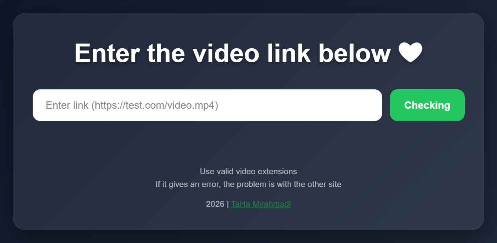

# Web Downloader

**SwiftDown** is a lightweight, beautiful, and fast web-based downloader interface. Built with a focus on modern UI/UX and simplicity.

## Features
- **Modern UI**
- **Responsive**
- **Ultra Lightweight**
- **Dark Mode**

## Tech Used
- **HTML**
- **CSS**
- **JavaScript**

## Live Demo
Show the latest software version: [**Live Demo Link**](https://TahaMirahmadi8.github.io/Downloader/)

## Preview

## Contributing
Since I am building this in public, I'd love your help! Feel free to fork, open issues, or submit pull requests.

---
Dev By [Taha Mirahmadi](https://github.com/TahaMirahmadi8)
